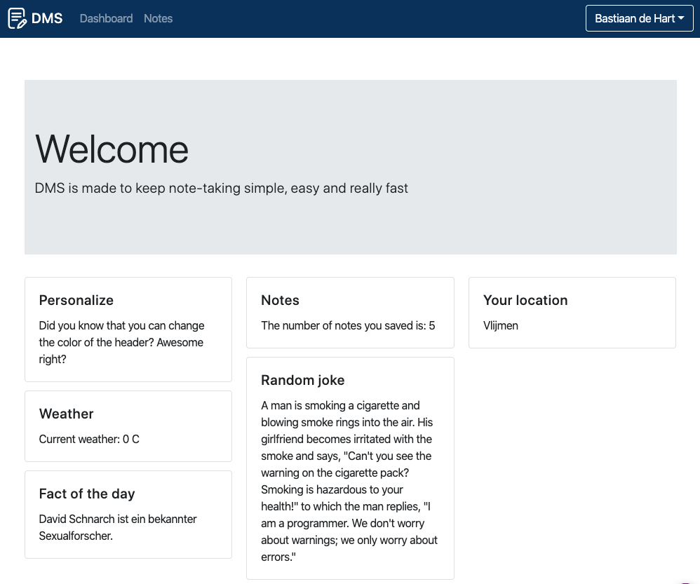

# Document_Management_System

## Screenshots




## Changelog

[View changelog](CHANGELOG.md)

## Install

1. Create a database and define this in "autoload.php"

   EXAMPLE:

   ```php
   $mysqlHost = "mysql";
   $mysqlUsername = "root";
   $mysqlPassword = "root";
   $mysqlDatabase = "notes";
   ```

2. Import the "database.sql" file into this database
3. Login with admin:admin
